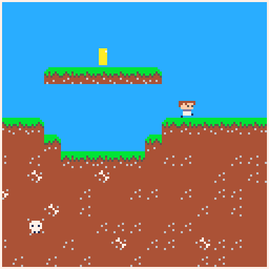
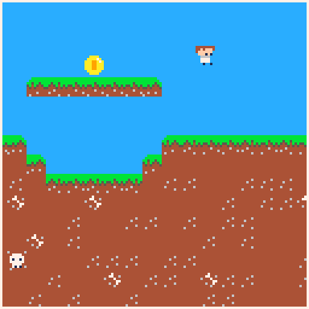
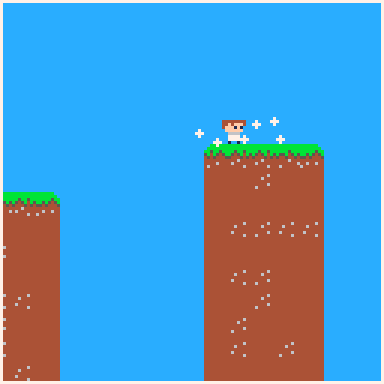
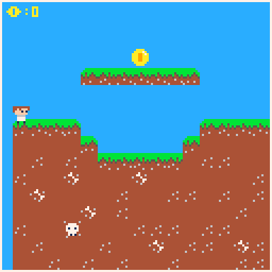
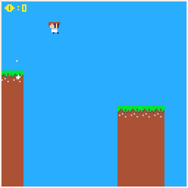
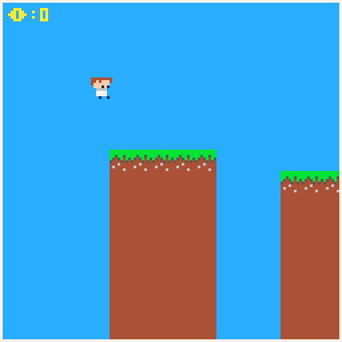

# vulakan-runner-pico8
a infinite runner game

<h1>1. test</h1>

added physics and character controler with all the animations

<h1>2. test</h1>

added double jump

<h1>3. test</h1>

added a particles when you move and when you fall after a long jump and added a sound effects

<h1>4. test</h1>

added a coin collection system and a kill system then smoothed up the eye animation and expanded the test level

<h1>5. test</h1>
<h2>random generation alpha</h2>

added a system to appednd the game map with platforms

<h2>random generation alpha 2</h2>

the platforms are randomized by the width between them and by the height so the player can jump on each one aka the platform generation is done now I need to add coins a death pit to the randomly genrated map
